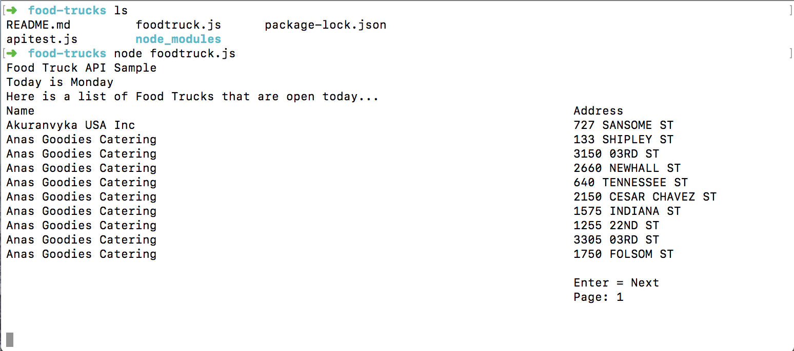
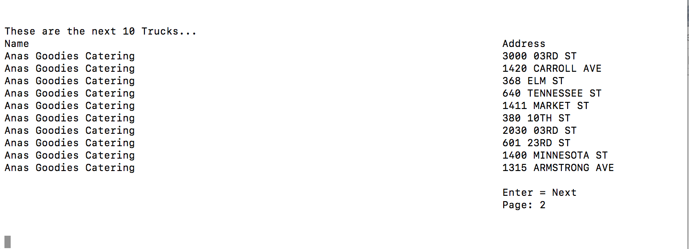

# Food Truck API Sample

## Install Dependencies

* [Node](https://nodejs.org/en/): with Homebrew use the following command: brew install node
* [axios](https://github.com/axios/axios): npm install -g axios
* [readline](https://thisdavej.com/making-interactive-node-js-console-apps-that-listen-for-keypress-events/): npm install -g readline

## Overview

The goal of this is to write a simple command-line program that will print out a list of food trucks,
given a source of food truck data from the San Francisco government’s API.

* Clone this into your local repository
* With the terminal open, navigate to where you have saved this project
* Install dependencies
* Type node foodtruck.js to run the program:

* Press enter to return the next 10 items:

## Technical Requirements

Write a command line program that prints out a list of food trucks that are open at the current
date, when the program is being run. So if I run the program at noon on a Friday, I should see a
list of all the food trucks that are open then.

### Additional notes

Please display the name and address of the trucks and sort the output alphabetically by name.
Please display results in pages of 10 trucks. That is: if there are more than 10 food trucks open,
the program should display the first 10, then wait for input from the user before displaying the
next 10 (or fewer if there are fewer than 10 remaining), and so on until there are no more food
trucks to display.
Please do not include tests in your submission, but please do write testable code.

## Approach Taken

* Researched API given the resources provided
* Developed a call to the API that would return a list of food trucks in alphabetical order based on the day of the week chosen using the security code given.
* Created arrays to store names and addresses of the food trucks for the current day
* Added a way to display a list of 10 items at a time

## Built With

* [Node](https://nodejs.org/en/) - axios, readline

## Referenced

* [San Francisco - Food Trucks Data Source](https://data.sfgov.org/Economy-and-Community/Mobile-Food-Schedule/jjew-r69b) 
* [San Francisco - API Data Structure](https://dev.socrata.com/foundry/data.sfgov.org/bbb8-hzi6)

## Interesting Notes

* New meal plans are generated each week
* The user can generate a meal plan from their profile page
* The user can adjust their settings as they lose or gain weight to see their individual macronutrient suggestions

## Next Steps

* Add a function to print the next 10 lines
* Fix Spacing between fields with different lengths of names
* Create a back input that looks at the previous days
* Add input to choose which day of the week
* Add a secondary sort for location
* Display other relevant fields
* What about time zones and time shifts?
* Provide an alternative styling for Food Trucks that are already closed at the given time

## Author

**Justin Mitchell** - [JustinPMitchell](https://github.com/JustinPMitchell)